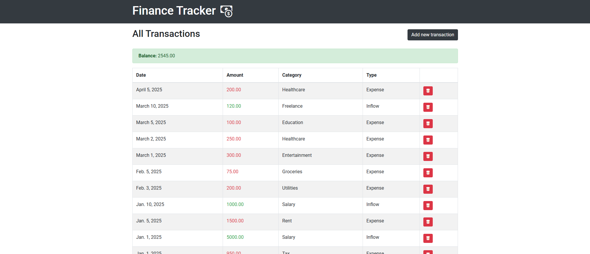

# Finance Tracker

## Overview

**Finance Tracker** is a simple **MVC (Model-View-Controller)** demo application built with Django.

### Features

* **Track Transactions**: Record financial transactions, either as **inflows** (e.g., salary) or **expenses** (e.g.,
  rent).
* **Categories**: Transactions can be categorized (e.g., Salary, Rent, Tax, etc.).
* **Balance Calculation**: The app calculates the balance by subtracting total expenses from total inflows.
* **CRUD Operations**: You can create, update, and delete transactions.
* **UI**: Simple and functional.
* **Admin Panel**: Additional way of adding new records to the db (transactions, categories).
* **Example Data Migration**: A custom migration is included to insert example categories and transactions into the database for development and demo purposes.



## Models

1. **Category**: Represents different types of categories for transactions, such as "Salary", "Rent", "Food", etc.
2. **Transaction**: Represents an individual transaction with fields like `amount`, `date`, `type` (inflow or expense),
   and `category`.
3. **TransactionType**: An enumeration that defines the two types of transactions: `EXPENSE` and `INFLOW`.

## Views

* **Index View**: Displays a list of all transactions with the ability to see the balance (sum of all inflows minus sum
  of all expenses).
* **Add Transaction View**: Allows users to add a new transaction.
* **Edit Transaction View**: Allows users to edit an existing transaction.
* **Delete Transaction View**: Allows users to delete a transaction.

---

## 🚀 Getting Started

### 1. Ensure You Are in the Correct Directory

Navigate to the `mvc/finance_tracker` directory, where the project’s files are located.

```bash
cd mvc/finance_tracker
```

### 2. Create a Virtual Environment

Create a virtual environment to manage project dependencies.

```bash
py -m venv .venv  # Windows
python3 -m venv .venv  # Linux/macOS
```

### 3. Activate the Virtual Environment

Activate the virtual environment to ensure the project dependencies are isolated.

```bash
.venv\Scripts\activate  # Windows
source .venv/bin/activate  # Linux/macOS
```

### 4. Install Dependencies

Install all the required dependencies using `pip`.

```bash
pip install -r requirements.txt
```

### 5. Configure Development Mode

Ensure you are running in **developer mode** by checking that `DEBUG=True` is set in `settings.py`.

```python
DEBUG = True
```

### 6. Apply Migrations

Run the following command to apply the database migrations and set up your models:

```bash
py manage.py migrate  # Windows
python3 manage.py migrate  # Linux/macOS
```

This will set up the database and insert example data for categories and transactions if `DEBUG=True` is set.

### 7. Run the Development Server

Start the Django development server to view the app in your browser:

```bash
py manage.py runserver  # Windows
python3 manage.py runserver  # Linux/macOS
```

Once the server is running, you can access the app at `http://127.0.0.1:8000/`.
